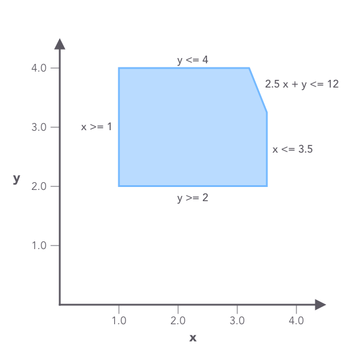
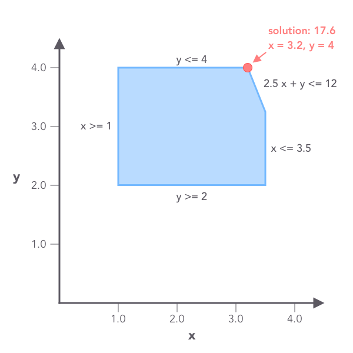

## Linear programming

*Linear programming* (*LP*, or *linear optimization*) is a method to compute the best solution (such as maximum revenue or lowest cost) to a problem modeled as a set of linear relationships.

*Linear programming* can be applied many fields such as retail, transportation and manufacturing. In [FreeWheel](https://freewheel.com) we use linear programming to solve various business and engineering problems.

## A simple example

Here is a simple example of a linear programming problem:

\begin{align}
& \text{Maximize} && \mathbf{3x + 2y} \\ & \text{subject to} && \mathbf{2.5x + y <= 12} \\ & \text{and} && \mathbf{1 \leq x \leq 3.5} \\ & \text{and} && \mathbf{2 \leq y \leq 4}
\end{align}

The objective here is to maximize the value of $3x + 2y$, with constriants given as linear expressions.

The three constraints defined a feasible region shown as below:



The objective here is to find a spot that maximizes $$3x + 2y$$ in the above region.

## Solve it with Flipy

The above LP problem can be easily solved with Flipy:

```python
import flipy

# 1 <= x <= 3.5
x = flipy.LpVariable('x', low_bound=1, up_bound=3.5)
# 2 <= y <= 4
y = flipy.LpVariable('y', low_bound=2, up_bound=4)

# 5x + y <= 12
lhs = flipy.LpExpression('lhs', {x: 2.5, y: 1})
rhs = flipy.LpExpression('rhs', constant=12) 
constraint = flipy.LpConstraint(lhs, 'leq', rhs)

# maximize: 3x + 2y
objective = flipy.LpObjective('test_obj', {x: 3, y: 2}, sense=flipy.Maximize)
problem = flipy.LpProblem('test', objective, [constraint])

solver = flipy.CBCSolver()
status = solver.solve(problem)
```

## Get the solution 

After solving, a status is returned to indicate whether the solver has found a optimal solution for the problem:

```python
print(status)
# <SolutionStatus.Optimal: 1>
```

The objective value, which is the maximum of $$3x + 2y$$, can be retrieved with `objective.evaluate()`:

```python
print(objective.evaluate())
# 17.6
```

The values of $$x$$ and $$y$$ can be retrieved as well:

```python
print(x.evaluate())
# 3.2
print(y.evaluate())
# 4.0
```


